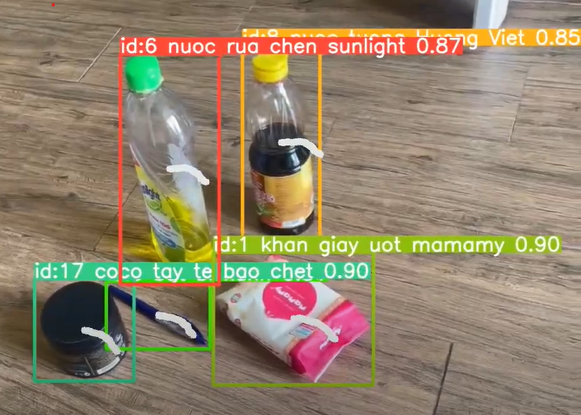
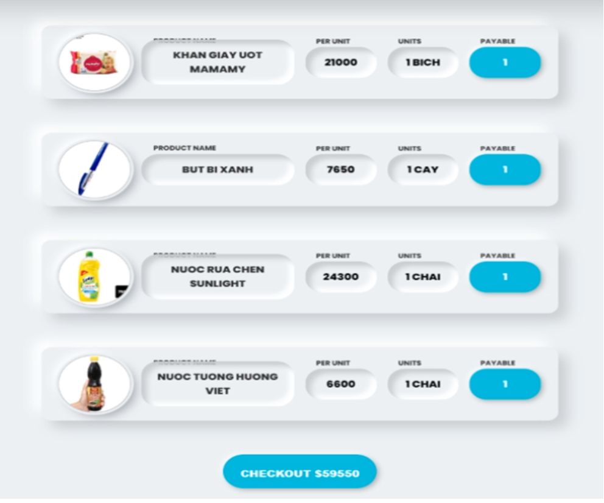

# 🛒 Take-n-Pay

Repository này chứa mã nguồn của dự án Công nghệ Thông tin của chúng tôi, tập trung vào việc phát triển hệ thống thanh toán dựa trên nhận diện sản phẩm.

## Tổng quan

Dự án "Take-n-Pay" nhằm tạo ra một hệ thống hiệu quả và thân thiện với người dùng để nhận diện sản phẩm trong quá trình thanh toán. Bằng cách tận dụng công nghệ, chúng tôi nhằm tối ưu hóa trải nghiệm thanh toán cho cả khách hàng và doanh nghiệp.

## 🚀 Tính năng

- **Nhận diện Sản phẩm:** Sử dụng thuật toán tiên tiến để nhận diện chính xác sản phẩm, giúp quá trình thanh toán diễn ra mượt mà.

- **Giao diện Thân thiện Người dùng:** Thiết kế giao diện trực quan để mang đến trải nghiệm người dùng mượt mà và thuận tiện.

- **Sửa Lỗi Bugs:** Thường xuyên cập nhật mã nguồn để khắc phục các lỗi đã xác định và nâng cao sự ổn định của hệ thống.

## 📦 Cài Đặt

Để bắt đầu với dự án, làm theo các bước sau:

```bash
git clone https://github.com/ThongNguyenDT/take-e-pay.git
```
### 📦 File dự án:

1. [Quá trình Train cho AI](#data-for-train-ai)
2. [Main Code](#main-code)
3. [Full large git of project](https://office365banquyen-my.sharepoint.com/:f:/g/personal/thongnguyen_office365banquyen_onmicrosoft_com/El7ZO10P_ZVFuQlFGKKLAJYBCoxla_Ny3sGTF5bxQes2Dg?e=LzDkfn)

## 🚀 Sử Dụng
1. Mở ứng dụng trong trình duyệt ưa thích của bạn.
2. Chuyển đến phần nhận diện sản phẩm.
3. Làm theo hướng dẫn trên màn hình để hoàn thành quá trình thanh toán.

## 🔍 Sửa Lỗi Detective

Trong bản cập nhật này, chúng tôi tập trung vào việc sửa lỗi được xác định thông qua công việc phân tích. Chúng tôi cam kết cung cấp một hệ thống mạnh mẽ và đáng tin cậy, và ý kiến phản hồi của bạn rất quan trọng để đạt được mục tiêu này.

Nếu bạn gặp bất kỳ vấn đề nào hoặc có ý kiến đóng góp, đừng ngần ngại [gửi ý kiến](https://github.com/ThongNguyenDT/take-e-pay/issues).

## ✨ Sản phẩm
<div align="center">

| AI nhận diện | Trang giỏ hàng |
|--------------|-----------------|
|  |  |
</div>

## Data for Train AI
🚀 [AI Identifies products](https://drive.google.com/drive/folders/1-o0GijxGF4EhhZGRwn5mXXvJRCGwsFPV?usp=drive_link) 🚀

## Main Code
✨[COLAB](https://colab.research.google.com/drive/12ClH3xnHauMq-hp8gKmO8y5K3oAh6cEZ?usp=sharing)✨

🔍[Prepare code](https://colab.research.google.com/drive/1A-cyJgsHko05O3ATkH1WET-0LeVeihHH?usp=sharing)🔍

## Video Report
[](https://www.youtube.com/watch?v=OBr7VX_gq58)


## 👥 Người Đóng Góp
- Nguyễn Dương Tiến Thông [(ThongNguyenDT)](https://github.com/ThongNguyenDT)
- Trần Xuân Thanh Thiện [(TXTThien)](https://github.com/TXTThien)
- Huỳnh Thiện Thọ [(ThienTho123)](https://github.com/ThienTho123)

## Bảng Phân Công
| TT | Tên Sinh Viên | Mô Tả Công Việc | Phần Trăm Đóng Góp |
| -- | -------------- | --------------- | ------------------ |
| 1 | Nguyễn Dương Tiến Thông | - Triển khai thuật toán nhận diện AI.<br>- Phát triển BoT-SORT và tích hợp Utralytics.<br>- Sử dụng GPU của Google Colab để tối ưu hóa quá trình nhận diện.<br>- Thiết kế giao diện giỏ hàng. | 100% |
| 2 | Trần Xuân Thanh Thiện | - Annotate và huấn luyện mô hình AI.<br>- Nghiên cứu về YOLO V8, BoTSORT, Utralytics để áp dụng vào dự án.<br>- Kiểm tra và đảm bảo hiệu suất của thuật toán.<br>- Sửa lỗi thuật toán.<br>- Thực hiện kiểm thử chất lượng. | 100% |
| 3 | Huỳnh Thiện Thọ | - Annotate và huấn luyện mô hình AI.<br>- Viết báo cáo.<br>- Kiểm tra và sửa lỗi thuật toán.<br>- So sánh hiệu suất giữa các thuật toán đã nghiên cứu.<br>- Tích hợp VNPay vào hệ thống thanh toán.<br>- Thực hiện kiểm thử và đánh giá tính ổn định. | 100% |

